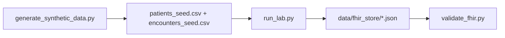

# GCP Healthcare API Concepts Lab (FHIR R4 Simulation)

**Author:** Faiz Elahi · **Type:** EDUCATIONAL PORTFOLIO LAB · **SYNTHETIC DATA ONLY**

---

## Educational disclaimer / synthetic data

This lab builds and validates **synthetic FHIR R4 JSON** locally. It does **not** call the Google Cloud Healthcare API, does not create GCP projects, and does not store real PHI. Patient and encounter content is **fabricated for learning**.

Use honest language: *“I generated FHIR Patient and Encounter resources from CSV seeds and validated them with fhir.resources.”*

---

## Problem statement (detailed)

Healthcare interoperability on GCP centers on **FHIR stores** in the Healthcare API—resources like **Patient** and **Encounter** with strict R4 structure. Engineers and analysts must explain:

- How **seed tables** become JSON resources
- How **references** link encounters to patients (`Patient/{id}`)
- Why **validation** catches schema mistakes before load jobs

This lab runs entirely on your laptop: seeds → **`src/run_lab.py`** writes JSON under `data/fhir_store/` → **`src/validate_fhir.py`** counts valid vs invalid files using **`fhir.resources`**.

---

## Why this tool

| Reading FHIR spec only | This lab pipeline |
|------------------------|-------------------|
| Passive learning | Build + validate round trip |
| Mystery JSON blobs | Traceable CSV → resource mapping |
| Cloud cost | Zero API spend |

Pairs with **`hl7-fhir-interop-lab`** and **`azure-health-data-platform-lab`**.

---

## Architecture



Honest mapping: documentation references **Healthcare API** and **BigQuery** concepts to support interviews—**nothing here creates billable GCP resources**.

See [`docs/architecture.md`](docs/architecture.md).

---

## Dataset dictionary (tables / columns)

| File | Grain | Key columns | Notes |
|------|-------|-------------|-------|
| `patients_seed.csv` | Patient seed | `patient_key`, `given_name`, `family_name`, `birth_date`, `gender` | Drives Patient resources |
| `encounters_seed.csv` | Encounter seed | `encounter_id`, `patient_key`, `class_code` | Drives Encounter resources |
| `fhir_store/Patient-*.json` | FHIR Patient | R4 JSON | One file per patient |
| `fhir_store/Encounter-*.json` | FHIR Encounter | R4 JSON with `subject.reference` | One file per encounter |

---

## Prerequisites

- Python 3.10+
- `pandas`, `fhir.resources` (see `requirements.txt`)

---

## Step-by-step: how to run

### Windows PowerShell

```powershell
cd gcp-healthcare-api-concepts-lab
python -m venv .venv
.\.venv\Scripts\Activate.ps1
pip install -r requirements.txt
python scripts/generate_synthetic_data.py
python -m src.run_lab
python -m src.validate_fhir
python scripts/generate_charts.py
```

### Optional bash

```bash
cd gcp-healthcare-api-concepts-lab
python3 -m venv .venv && source .venv/bin/activate
pip install -r requirements.txt
python scripts/generate_synthetic_data.py
python -m src.run_lab
python -m src.validate_fhir
python scripts/generate_charts.py
```

---

## File-by-file walkthrough

| Path | Role |
|------|------|
| `scripts/generate_synthetic_data.py` | Creates seed CSVs (~100 patients/encounters scale) |
| `src/run_lab.py` | Builds Patient/Encounter JSON via `fhir.resources` models |
| `src/validate_fhir.py` | Parses each JSON; prints valid/invalid counts |
| `scripts/generate_charts.py` | Optional charts under `docs/images/` |
| `data/fhir_store/` | Output JSON library for inspection |

---

## Expected outputs and how to interpret them

- Console from **`run_lab.py`**: count of JSON files written to `data/fhir_store/`.
- Console from **`validate_fhir.py`**: **`Validation complete: N valid, M invalid`**.
- Open **`Patient-*.json`** — map `name`, `birthDate`, `gender` to seed columns.
- Open **`Encounter-*.json`** — verify `subject.reference` matches patient keys.

Any invalid file prints **`INVALID {filename}`** with exception text—use for debugging exercises.

---

## Results interpretation

- **Finished** encounter status is static in builder—not a clinical workflow state machine.
- **Class codes** use HL7 v3 ActCode system URI—simplified vs full coding arrays in production.
- Validation success means **schema-level** correctness—not semantic interoperability testing (US Core profiles, etc.).

---

## Glossary (8+ terms)

1. **FHIR R4** — Fast Healthcare Interoperability Resources release 4.
2. **Healthcare API** — GCP managed FHIR/DICOM/HL7v2 services (not called here).
3. **Patient resource** — Demographics and identity anchor resource.
4. **Encounter resource** — Visit or episode context linked to patient.
5. **Reference** — JSON pointer such as `Patient/{id}` on Encounter.subject.
6. **FHIR store** — Document store for resources (simulated as local folder).
7. **Validation** — Structural check via `fhir.resources` parsers.
8. **Seed CSV** — Tabular source prior to resource generation.
9. **Interoperability** — Exchange of standardized healthcare data across systems.

---

## Common mistakes (5+)

1. Claiming you **deployed Healthcare API FHIR stores** from this repository alone.
2. Confusing **HL7 v2 messages** with **FHIR JSON** resources.
3. Shipping **real patient names** into public repos—even “test” clinics.
4. Skipping **profile compliance** (US Core) when discussing production readiness.
5. Treating **validation pass** as HIPAA compliance.
6. Editing JSON by hand without re-running validation before demos.

---

## Exercises (5+)

1. Add **Observation** vitals linked to Patient and Encounter references.
2. Write a one-page **consent and PHI handling** policy for dev environments (habits matter).
3. Batch-load JSON listing into a **BigQuery external table** design doc (no cloud required).
4. Break one required field intentionally and trace **validate_fhir** error message.
5. Compare resource shapes to **`hl7-fhir-interop-lab`** mappings.
6. Document **de-identification** steps if seeds ever came from real extracts (conceptual).

---

## Limitations / simulation vs production

- No GCP IAM, Cloud Healthcare API quotas, or Pub/Sub notification feeds.
- Subset of resource types—no Bundle transactions or search parameters.
- Synthetic identities only—not representative cohorts.
- Educational code—**not a HIPAA reference deployment**.

---

## Related labs

- [`hl7-fhir-interop-lab`](../hl7-fhir-interop-lab/) — Broader interop patterns.
- [`azure-health-data-platform-lab`](../azure-health-data-platform-lab/) — Medallion clinical feeds.
- [`epic-clarity-reporting-lab`](../epic-clarity-reporting-lab/) — Relational reporting contrast.

---

**Author:** Faiz Elahi · Educational portfolio use.
